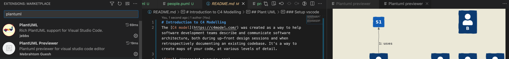

# Introduction to C4 Modelling
The [C4 model](https://c4model.com/) was created as a way to help software development teams describe and communicate software architecture, both during up-front design sessions and when retrospectively documenting an existing codebase. It's a way to create maps of your code, at various levels of detail.


## Plant UML

C4-PlantUML combines the benefits of [PlantUML](https://plantuml.com/) and the [C4 model](https://c4model.com/) for providing a simple way of describing and communicate software architectures – especially during up-front design sessions – with an intuitive language using open source and platform independent tools. Familiarise yourself with the C4 Model on the web site and this will become an intuitive way of communicating at the correct level.

- Please read https://github.com/plantuml-stdlib/C4-PlantUML#c4-plantuml to start understanding the way this can be added into your code as living diagraming and documentation which should always change as your project does

### Setup vscode

- Under the Marketplace extensions, add PlantUML and PlantUMLPreview

  

- Under the source code of any diagram with the `.puml` extension, type the following to preview the diagram

  ```powershell
  CTRL + P (Windows/Linux)
  CMD + P (Mac)
  ```

- Add [snippits to VScode](https://github.com/plantuml-stdlib/C4-PlantUML/blob/master/.vscode/C4.code-snippets) to help with code completion by copying this into your global setup

- **Note** there are other ways with installing GraphViz and other previewers but this was the simplest for me to get going

  


