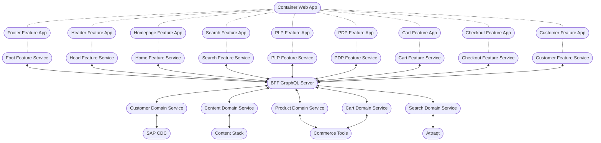

# MFE - Circling the Square!

## Integration Techniques

Build time integration not recommended (see [here](https://martinfowler.com/articles/micro-frontends.html#Benefits)) - this is our current approach, and probably the most practical approach but we should be aware of the trade-offs.

Run time integration is more complex but gives benefits around looser coupling, ability to publish new MFEs entirely independently to production, ability to use different libraries and versions without fear of breaking other aspects of the application

Runtime downsides: potential library bloat, i.e. duplicate downloads of libraries to clients (although can be managed using something like shared modules via webpack's module federation), unable to offer SSR and SSG pages (at least to the best of my knowledge) which undermines one of the major use cases for selecting NextJs?

## Decoupling

The MFE approach promotes decoupling the full stack of development through vertical slices of the application.

Our current approach uses micro services for the backend (generally integrating with 3rd party vendors for persistence and domain specific logic), these micro-services are consolidated into a singular GraphQL Backend for Front end layer (specifically designed to be consumed by the monolithic web app).  The web-app then queries and mutates data via the BFF.  The diagram below illustrates the current set up

The current proposed approach to Micro-Frontends seeks to split the WebApp into Feature Apps and Feature Services, but retains the singular BFF.

Thus we end up with something like this:

Unless I've misunderstood the intended implementation, the current proposed approach to MFEs will result in a tangle of dependencies and a singular monolithic BFF Server.

A cleaner approach would be to avoid the sharing of Feature Services across different Feature Apps, each Feature App should have it's own Feature Service.  This will be some duplication of code, however, it reduces coupling (one of MFE's key benefits).  It's likely that one shared Feature Service will remain to handle such cross cutting concerns as customer and authentication.  In this version the singular BFF is retained, as it may have some benefits around state management and caching - **TBC**

Feature Services are simply used to abstract business logic and data access concerns out of React components - which should be centred on presentation concerns.

